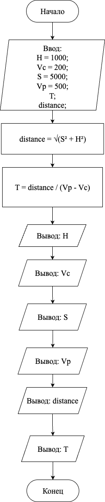

# Домашнее задание к работе 2

## Условие задачи
Самолет летит по прямой на высоте Н метров со скоростью Vc м/с в направлении зенитной пусковой установки. Когда до нее остается S метров по нему выпускается ракета со скорость Vp. Считая, что до места встречи, ракета летит по прямой и радиус её действия бесконечен, определить Т – время до поражения цели.

---

## 1. Алгоритм и блок-схема

### Алгоритм
1. Начало
2. Объявить переменные:
	- `H`
	- `Vc`
	- `S`
	- `Vp`
	- `T`
3. Задать исходные данные:
	- `H = 1000 - высота полета самолета (метров)`
	- `Vc = 200 - скорость самолета (метров в секунду)`
	- `S = 5000 - горизонтальное расстояние до цели (метров)`
	- `Vp = 500 - скорость ракеты (метров в секунду)`
4. Вычислить расстояние до цели по теореме Пифагора: distance = √(S² + H²)
5. Вычислить время до поражения: T = distance / (Vp - Vc)
6. Вывести исходные высоту H: 1000 метров
7. Вывести исходную скорость самолета Vc: 200 метров в секунду
8. Вывести исходное расстояние S: 5000 метров
9. Вывести исходную скорость ракеты Vp: 500 метров в секунду
10. Вычислить расстояние до цели
11. Вычислить время до поражения цели
12. Вывести результат (время до поражения цели): 16.997 секунд
13. Конец
### Блок-схема
 

---

## 2. Реализация программы

```c
#include <stdio.h>
#include <math.h>

int main() {

	double H = 1000;
	
	double Vc = 200;
	
	double S = 5000;
	
	double Vp = 500;
	
	double T;
	
	double distance = sqrt(S * S + H * H);
	
	T = distance / (Vp - Vc);
	
	printf("Исходные параметры\n");
	
	printf("\tВысота H: %f метров\n", H);
	
	printf("\tСкорость самолета Vc: %f метров в секунду\n", Vc);
	
	printf("\tРасстояние S: %f метров\n", S);
	
	printf("\tСкорость ракеты Vp: %f метров в секунду\n", Vp);
	
	printf("Решение:\n");
	
	printf("\Вычислим расстояние до цели (по теореме Пифагора: √(S² + H²)): √(%f + %f) = %f\n",S * S,H * H, distance);
	
	printf("Вычислим время до поражения цели (по формуле: Время = расстояние / относительную скорость),\n если относительная скорость = Vp - Vc (при условии, что ракета летит навстречу))): \n\t %f / (%f - %f)) = %f\n",distance,Vp,Vc,T);
	
	printf("Ответ: время до поражения цели: %f секунд\n", T);

        return 0;
}
```
# 3. Результаты работы программы
## Параметры:
1. H - высота полета самолета (метров) = 1000
2. Vc - скорость самолета (метров в секунду) = 200
3. S - горизонтальное расстояние до цели (метров) = 5000
4. Vp - скорость ракеты (метров в секунду) = 500
## Решение:
1. Найдём расстояние до цели (по теореме Пифагора: √(S² + H²)): √(25000000.000000 + 1000000.000000) = 5099.019514 (метров)
2. Найдём время до поражения цели (по формуле: Время = расстояние / относительную скорость), если относительная скорость = (Vp - Vc): 5099.019514 / (500.000000 - 200.000000)) = 16.996732 (секунд)
## Ответ:

```bash
Исходные параметры
	Высота H: 1000.000000 метров
	Скорость самолета Vc: 200.000000 метров в секунду
	Расстояние S: 5000.000000 метров
	Скорость ракеты Vp: 500.000000 метров в секунду
Решение:
	Найдём расстояние до цели (по теореме Пифагора: √(S² + H²)): √(25000000.000000 + 1000000.000000) = 5099.019514
	Найдём время до поражения цели (по формуле: Время = расстояние / относительную скорость), если относительная скорость = Vp - Vc)): 5099.019514 / (500.000000 - 200.000000)) = 16.996732

Ответ: время до поражения цели: 16.996732 секунд

[Done] exited with code=0 in 0.752 seconds
```
